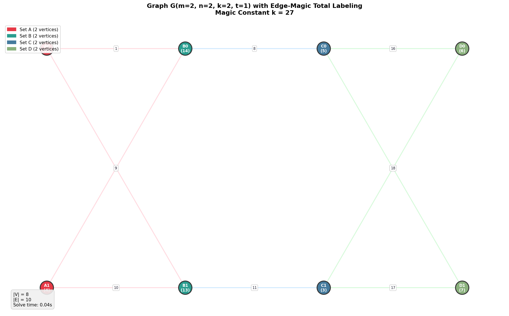

# Edge-Magic Total Labeling Solver

An exact constraint-programming solver for **Edge-Magic Total Labelings (EMTL)** on a
parameterized family of four-partite graphs `G(m, n, k, t)`. The project constructs the
graph, casts EMTL existence as a constraint-satisfaction problem, solves it with Google
OR-Tools **CP-SAT**, independently verifies any labeling it finds, and visualizes the
result. It ships with a test suite, a batch example runner, and a Streamlit web app.

An **edge-magic total labeling** of a graph `G = (V, E)` is a bijection
`f: V ∪ E → {1, …, |V|+|E|}` such that some constant `κ` satisfies
`f(u) + f(uv) + f(v) = κ` for every edge `uv`. The solver returns the magic constant and
labels when a labeling exists, a proof of infeasibility when none does, or a timeout.

<p align="center">
  
  <br>
  <em>A computed EMTL of <code>G(2,2,2,1)</code>: parts A, B, C, D (left to right); every edge sum equals the magic constant.</em>
</p>

> **Full write-up.** The mathematics — the graph family, the algebraic necessary
> conditions, the vertex-determination reduction, the CP-SAT model, and experiments —
> is documented in the accompanying article, available in both English and Persian:
> [`paper/emtl-article-en.pdf`](paper/emtl-article-en.pdf) ·
> [`paper/emtl-article-fa.pdf`](paper/emtl-article-fa.pdf).

## Quick start

Requirements: Python 3.8+ (3.11 recommended) and `pip`.

```bash
python3 -m venv venv
source venv/bin/activate
python -m pip install --upgrade pip
pip install -e .
```

If PyPI is blocked, install from a mirror:

```bash
pip install -e . --index-url https://mirror-pypi.runflare.com/simple
```

Run the interactive solver:

```bash
python emtl_solver.py
```

Launch the web app:

```bash
streamlit run web/app.py
```

Run the tests:

```bash
pytest tests -v
```

## Mathematical model (in brief)

The graph `G(m, n, k, t)` has four vertex parts `A, B, C, D` with `|A| = m`, `|B| = |C| = n`,
`|D| = k`, and three bipartite edge layers:

- a complete bipartite layer `K_{m,n}` between `A` and `B`;
- a `t`-regular bipartite layer between `B` and `C` (built by a circulant rule);
- a complete bipartite layer `K_{n,k}` between `C` and `D`.

Hence `|V| = m + 2n + k` and `|E| = mn + nt + nk`, with `m, n, k ≥ 1` and `0 ≤ t ≤ n`.

EMTL existence is modeled as a constraint-satisfaction problem with one integer variable per
vertex and per edge, an **all-different** constraint enforcing the bijection, one
**magic-sum** equation `x_u + x_{uv} + x_v = κ` per edge, and the magic constant bounded by
`6 ≤ κ ≤ 3(|V|+|E|) − 3`. No efficient general algorithm for EMTL is known; this project
solves the structured family `G(m, n, k, t)` *exactly* with CP-SAT, which returns a
verified labeling, an infeasibility result, or a timeout. See the article (above) for
the derivations, proofs, and the experimental study.

## Project structure

| Path | Contents |
|------|----------|
| `emtl_solver.py` | Core library: graph construction, CP-SAT model, verification, visualizer, CLI. |
| `web/app.py` | Streamlit web interface. |
| `examples/run_examples.py` | Batch runner that saves figures. |
| `tests/test_emtl.py` | Unit and integration tests. |
| `notebooks/EMTL_Tutorial.ipynb` | Walkthrough notebook. |
| `paper/` | The article (LaTeX sources + compiled English/Persian PDFs) and its build script. |
| `images/examples/` | Pre-rendered example labelings. |

Key API in `emtl_solver.py`: `GraphParameters`, `GraphConstructor`, `EMTLSolver`
(`.solve`, `.verify_labeling`), `EMTLVisualizer`, and the end-to-end
`solve_emtl(m, n, k, t, timeout=...)`.

## Building the article

```bash
cd paper && bash build.sh
```

The English PDF builds with `pdflatex`; the Persian PDF builds with `xelatex` (xepersian).
The Persian article uses the **XB Niloofar** font (free, SIL OFL) — install it first, e.g.
copy `XB Niloofar.ttf` into `~/.local/share/fonts/` and run `fc-cache -f`.

## License

Released under the [MIT License](LICENSE).

## Citation

If you use this work, please cite it via [`CITATION.cff`](CITATION.cff).

## Author

**Bardia Yaghmaie** — School of Mathematics and Computer Science, Iran University of Science and Technology (IUST).
Bachelor's research project, supervised by Prof. Mehdi Alaeiyan (Algebraic Graph Theory).
